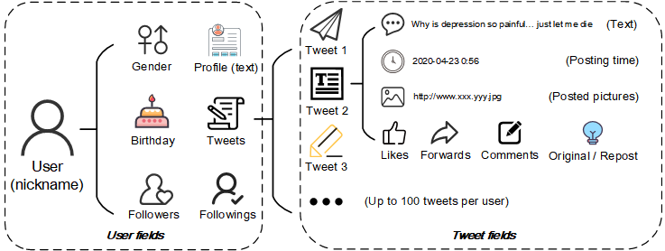
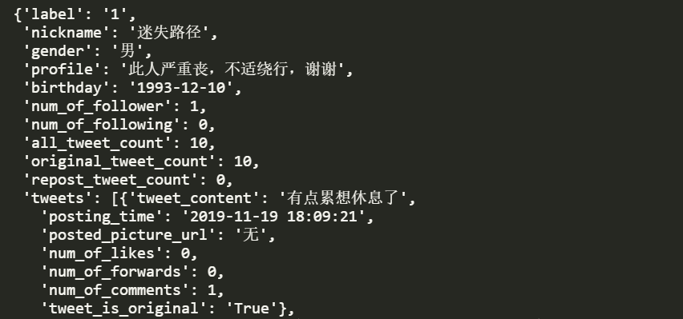

# Weibo User Depression Detection Dataset 

# 微博用户抑郁症检测数据集

## Introduction

- The Weibo User Depression Detection Dataset **(WU3D)** contains normal user samples and depressed user samples collected by a crawler using the crawling API provided by the Weibo official. 
- The dataset is stored by JSON files, with `depressed.json` for the depressed users and `normal.json` for the normal users. It can be download from [Google Drive](https://drive.google.com/file/d/1nzURaI60wF2s4P9-G2JDowirrx0VBelE/view?usp=sharing) or [Baidu Netdisk (百度云盘，提取码yar1)](https://pan.baidu.com/s/10xItuplkTNMmJdOEGBiXPw).
- The detailed information fields of a user include:

| Field Name           | Description                                                  |                           Example                            |
| -------------------- | ------------------------------------------------------------ | :----------------------------------------------------------: |
| nickname             | User nickname, a short text.                                 |                       小陈不要再抑郁了                       |
| gender               | User gender                                                  |                              男                              |
| profile              | A sentence of the user’s self-description, self-introduction, short text. |                这世界那么多人又不缺我一个活着                |
| birthday             | The birthday of the user, stored as a string in the format of "year-month-day". If the user does not fill in the year of birth, the "month-day" format is used. If the user does not fill in the information, the default content is "无" ("None" in English). |                          1991-07-25                          |
| label                | User label, 1 for depressed user, 0 for normal user.         |                              1                               |
| num_of_follower      | The number of user followers.                                |                              3                               |
| num_of_following     | The number of user followings.                               |                              12                              |
| all_tweet_count      | The total number of all the tweets.                          |                             137                              |
| original_tweet_count | The total number of original tweets.                         |                             128                              |
| repost_tweet_count   | The total number of repost tweets.                           |                              9                               |
| tweets               | Tweet field, a list of user tweets.                          |                              -                               |
| tweet_content        | Tweet text content.                                          | 抗抑郁的第72天 这次抑郁发作的起因是因为感情和友情的处理不当无法解决这些问题的我有些头疼好像世界都已经把我抛弃了... :( |
| posting_time         | The posting time of the tweet.                               |                       2020-05-01 00:32                       |
| posted_picture_url   | A list of URLs of pictures posted in the tweet. If no pictures are sent, the default value is "None". | `["http://wx2.sinaimg.cn/wap180/xxxx.jpg", "http://wx2.sinaimg.cn/wap180/yyyy.jpg"]` |
| num_of_likes         | The number of likes.                                         |                              1                               |
| num_of_forwards      | The number of forwards.                                      |                              0                               |
| num_of_comments      | The number of comments.                                      |                              3                               |
| tweet_is_original    | An identifier that identifies if the tweet is an original tweet. |                             True                             |

- An example of a user sample in given here:

- As of May 30, 2020, the candidate samples collected by the crawler and the various information of the samples in WU3D are shown in the following table. Once new data is updated later, the statistics in this table will be updated.

| Dataset    | Category  |  User  |  Tweet   | Picture |
| ---------- | --------- | :----: | :------: | :-----: |
| Candidates | Depressed | 125479 | 5478806  | 2354701 |
|            | Normal    | 65913  | 4927904  | 3631537 |
|            | Total     | 191392 | 10406710 | 5986238 |
| WU3D       | Depressed | 10325  |  408797  | 160481  |
|            | Normal    | 22245  | 1783113  | 1087556 |
|            | Total     | 32570  | 2191910  | 1248037 |

## Explanations and Issues

- In order to protect the privacy of depressed users, we have deleted the user IDs in WU3D.
- Instead, **we have uploaded the crawler script** and the script for data preprocessing. Researchers can further collect user samples based on our scripts. All the scripts and the deployment document `README.md` are placed in the folder `WU3D_crawler_preprocessing`.
- If  `encoding='utf-8'` doesn't work, try: `encoding='utf-8-sig'` when using `Python` to load the JSON file.

- Other issues will be updated soon...

## Contributions and Acknowledgements

- All the depressed user samples were manually data labeled by anonymous data labeling specialists and reviewed by psychologists and psychiatrists. We are grateful for the suggestions and help of these anonymous individuals.
- Chenghao Li (李丞浩) developed a Weibo data crawler and Zhang Yilin (张怡霖) carried out data screening and cleaning. The subsequent data labeling and expert review were also completed under the supervision and cooperation of both of them. We are very grateful for their work and contributions. 
- The interpretation right of this dataset belongs to Chenghao Li (李丞浩) and Zhang Yilin (张怡霖).  If there are any questions about the dataset, please contact: 
  - Chenghao Li (李丞浩): thebeacon9@gmail.com    **(Crawler Developer & Dataset Owner)**
  - Zhang Yilin (张怡霖) : 2726608449@qq.com    **(Dataset Owner)**
  - Yiding Wang (王一丁): devinwangfighting9867@gmail.com    **(Github Project maintainer)**
  - Zhenyi Wang (王臻懿): kun.wangzy@gmail.com    **(Github Project maintainer)**

